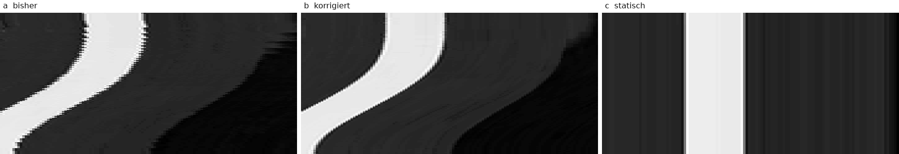

# Kamerafahrten: Zittern — Ursache, drei Probeclips, Entscheidung

**Stand 2026-08-17.** Drei 6-Sekunden-Clips aus **einem** vorhandenen Bild,
0 Credits, kein neues Material.

> ✅ **ENTSCHIEDEN: (b) ist der Standardweg, (c) bleibt je Einstellung
> ausdrücklich erlaubt.** Festgeschrieben in
> [`produktion/pipeline/kamerafahrt.py`](../../produktion/pipeline/kamerafahrt.py),
> [`produktion/config.md`](../../produktion/config.md) und
> [`produktion/szenenliste-vorgaben.md`](../../produktion/szenenliste-vorgaben.md).

| Clip | Datei | Was er zeigt |
|---|---|---|
| **(a)** | [`probe-a-bisher.mp4`](probe-a-bisher.mp4) | der frühere Weg — Vergleichspunkt |
| **(b)** | [`probe-b-korrigiert.mp4`](probe-b-korrigiert.mp4) | **der Standardweg** |
| **(c)** | [`probe-c-statisch.mp4`](probe-c-statisch.mp4) | ohne Bewegung — erlaubte Alternative |

Alle drei: 1920×1080, 24 fps, **exakt 6,000 s / 144 Frames**, dieselbe Quelle
([`stil-1-flatvector-szeneA.png`](../stile-erklaerkanal/stil-1-flatvector-szeneA.png)),
dieselbe Bewegung (Zoom 1,00 → 1,08 mit Schwenk, Kosinus-Rampe), dieselbe
Kodierung. **Der einzige Unterschied ist der Weg, auf dem die Fahrt
entsteht.** Zusammen 3,9 MB — kein Aufteilen in Teile nötig, die Grenze bei
GitHub liegt bei 100 MB je Datei.

(b) und (c) sind **nicht nachgebaut**, sondern von
`produktion/pipeline/kamerafahrt.py` erzeugt — demselben Programm, das die
Pipeline aufruft. (a) baut den Filter so, wie er vorher in
`schritt5_video.py` stand.

Das Motiv ist absichtlich flacher Vektorstil mit harten Konturen: dünne
Tischbeine, Fensterrahmen, Regalkanten. Genau die Bildwelt, in der das
Problem auffällt.

---

## Schritt 1 — die Ursache

Die Fahrt entstand in `schritt5_video.py::zyklus_bauen`, Kern war:

```python
vf = (f"zoompan=z='{z}':x='iw/2-(iw/zoom/2)':y='ih/2-(ih/zoom/2)'"
      f":d=1:s={cfg['breite']}x{cfg['hoehe']}:fps={fps},format=yuv420p")
```

Maßgeblich ist, was `vf_zoompan.c` daraus je Frame macht:

```c
w = in->width  * (1.0 / zoom);      /* int — abgeschnitten */
h = in->height * (1.0 / zoom);      /* int — abgeschnitten */
x = av_clipd(dx, 0, in->width - w); /* int — abgeschnitten */
```

**Der Ausschnitt rastet auf ganze Quellpixel ein — Größe *und* Lage.** Die
Zoomstufe ist eine Fließkommazahl, der Ausschnitt, den sie beschreibt, ist es
nicht. Die Fahrt steht still und springt dann um einen ganzen Quellpixel.

Von den vier bekannten Kandidaten treffen **drei zu, und sie verstärken
einander:**

| Kandidat | Befund |
|---|---|
| **Rundung der Zoomstufe je Frame** | ✅ **Hauptursache.** Ausschnittsbreite und ‑lage sind `int`. Nicht die Zoomrate ist schuld, sondern dass `zoompan` sie auf ganze Quellpixel rundet. |
| **Hochskalierung statt Herunterskalierung** | ✅ **Verstärker, und hausgemacht.** [`schritt4_bild.py:40`](../../produktion/pipeline/schritt4_bild.py) (`zuschneiden`) skalierte **jede** Quelle vorab per LANCZOS auf 1920×1080 und speicherte erst dann. Unsere Quellen sind **2752×1536**. Die Reserve war weg, bevor die Fahrt begann — `zoompan` schnitt danach aus 1920 px einen 1778‑px‑Ausschnitt und zog ihn **wieder auf 1920 hoch**. Ein Quellpixel = ein Ausgabepixel, also rastete die Fahrt auf volle Bildpixel. |
| **zu kleiner Zoombereich über zu viele Frames** | ✅ **Im Originalfall katastrophal.** `zoom_faktor 1.04` über `zoom_zyklus_s 300` bei 24 fps = 7200 Frames auf 74 Rasterstufen → **99,0 % der Frames sind exakte Standbilder**, dazwischen ein Sprung von 1,04 px. |
| **fehlende/schwache Interpolation** | ⚠️ **Vorhanden, aber nicht die Ursache — und in `zoompan` nicht abstellbar.** `ffmpeg -h filter=zoompan` kennt genau sieben Optionen: `zoom/z, x, y, d, s, fps`. **Keine Flags-Option.** Der interne Skalierer ist auf `SWS_BICUBIC` festgenagelt. Bessere Interpolation gibt es nur *um* `zoompan` herum. |

### Warum das gerade bei flachen Grafiken auffällt

Ein Sprung um einen Pixel ist immer da. Sichtbar wird er an der Kante: eine
harte Kontur zwischen zwei einfarbigen Flächen springt als **ganze Kante**
um eine Pixelspalte. In einem fotografischen Bild mit Textur und Rauschen
verschwindet derselbe Sprung im Detail. Unsere Bildwelt ist der ungünstigste
Fall.

### Nachgerechnet

`quantisierung.py` simuliert die drei `int`-Zeilen Frame für Frame.
„Zittern" = wie weit die gerastete Lage von der ideal glatten Bahn abweicht,
in **Ausgabepixeln** — die Fahrt selbst ist herausgerechnet, übrig bleibt der
Sägezahn der Rundung.

| Was `zoompan` am Eingang sieht | ein Quellpixel in Ausgabepixeln | Zittern Lage | Zittern Skala |
|---|---|---|---|
| 1920 px, Zyklus 1,04 / 300 s | 1,000 | 1,04 px | 0,52 px |
| 1920 px, 6‑s‑Einstellung | 1,000 | 1,34 px | 0,51 px |
| 2730 px (Quelle nativ) | 0,703 | 0,95 px | 0,38 px |
| **5760 px (3×)** | 0,333 | 0,46 px | 0,17 px |
| **7680 px (4×)** | 0,250 | **0,35 px** | **0,13 px** |

---

## Schritt 2 — die drei Clips, gemessen

Nicht am Filtergraphen, sondern **am dekodierten Bild** der fertigen MP4s
(`messen.py`). „Ruckeln" ist die Streuung des Bildversatzes um seinen eigenen
glatten Verlauf — die beabsichtigte Fahrt ist herausgerechnet.

| | (a) bisher | (b) korrigiert | (c) statisch |
|---|---|---|---|
| **Ruckeln** | **0,998 px** | **0,150 px** | **0,000 px** |
| eingefrorene Frames | 19 von 143 | 9 von 143 | — (statisch) |
| Bewegung \|Δ\| Median | 0,979 | 0,508 | 0,000 |
| Kantenschärfe Frame 0 | 0,827 | 0,908 | **0,964** |
| Kantenschärfe Frame 71 | 0,845 | 0,878 | **0,968** |
| Kantenschärfe Frame 143 | 0,853 | 0,905 | **0,968** |
| Rechenzeit für 6 s (4 Kerne) | 15 s | 30 s | 4 s |
| Dateigröße | 1,95 MB | 1,46 MB | 0,55 MB |

Die gemessenen **0,998 px** in (a) sind genau der vorausgesagte eine
Quellpixel. Ursachenanalyse und Messung stimmen überein.

**(b) ist (a) in jeder einzelnen Zeile überlegen** — ruhiger, an jedem
Zeitpunkt schärfer, und die Datei ist kleiner. Der Verdacht, die zweifache
Abtastung koste Schärfe, hat sich nicht bestätigt: sie gewinnt welche, weil
der Ausschnitt herunter- statt hochskaliert wird.

### Die Kantenspur



Dieselbe Bildzeile aus allen 144 Frames, untereinandergelegt — **Zeit läuft
nach unten**, Kontrast gespreizt. Links die Treppe, in der Mitte eine glatte
Kurve mit weichem Übergang, rechts die Senkrechte. Kein Diagramm, sondern die
Pixel selbst.

### Was (b) genau macht

```
Quelle 2752×1536
  → EINMAL scale=7680:4320:flags=lanczos    (4× Ausgabebreite)
  → loop                                    (hält das Ergebnis fest)
  → zoompan …:s=3840x2160                   (rastet auf 0,25 Ausgabepixel)
  → scale=1920:1080:flags=lanczos           (mittelt den Rest weg)
```

Drei Dinge auf einmal: Die Rasterstufe sinkt auf ein Viertel Ausgabepixel;
der Ausschnitt wird **herunter**- statt hochskaliert, behält also echtes
Detail; und die letzte Reduktion von 3840 auf 1920 verwandelt den Restsprung
in eine weiche Helligkeitsänderung an der Kante statt in einen Versatz —
genau das, was Bewegung unterhalb eines Pixels ausmacht.

Der `loop`-Filter ist der Grund, warum kein Zwischenbild auf die Platte muss:
die teure Vergrößerung läuft **einmal**, nicht 144‑mal. Bei 159 Einstellungen
hätte die Zwischendatei-Fassung ~3,8 GB Arbeitsdateien erzeugt.

**Zwei einfachere Fassungen wurden geprüft und sind schlechter:**

| Variante | Ruckeln | Schärfe Frame 0 | |
|---|---|---|---|
| 7680 → `zoompan` **s=3840** → lanczos 1920 | **0,148 px** | **0,807** | ✅ gewählt |
| 7680 → `zoompan` **s=1920** direkt | 0,250 px | 0,693 | verworfen |
| 5760 → `zoompan` **s=1920** direkt | 0,289 px | 0,699 | verworfen |

Grund: der interne Bicubic von `zoompan` ist als 4:1‑Verkleinerer schlecht.
Zweistufig — 2:1 bicubic, dann 2:1 lanczos — ist das Bild sowohl ruhiger
**als auch** um 15 % härter in der Kontur. (Die Schärfewerte dieser Tabelle
stammen aus dem Vergleichslauf vor der Rampenkorrektur unten und sind
untereinander, nicht mit der Tabelle darüber vergleichbar.)

### Der Preis von (b)

- **Rechenzeit ×2** gegenüber (a). Hochgerechnet auf ein 10‑Minuten‑Video:
  **rund 50 Minuten** Bildspur auf diesen 4 Kernen. Einmal je Video,
  über die Einstellungen parallelisierbar.
- Zwischenframes bei 7680×4320 und 3840×2160 brauchen Speicher.

Mehr nicht. Schärfe kostet es keine.

---

## Zwei Irrtümer, die beim Bauen aufgefallen sind

Beide sind gemessen und stehen hier, damit sie nicht wiederkehren.

### 1. Es kommt nicht auf die Auflösung der Quelldatei an

Naheliegend, aber falsch: „die Quelle muss mindestens 3× so breit sein wie
die Ausgabe". Entscheidend ist, was **`zoompan` am Eingang** sieht — und das
stellt die Überabtastung her, egal wie groß die Quelle war:

| | Ruckeln | Kantenschärfe Ende |
|---|---|---|
| Quelle 2752 px → auf 7680 gebracht | 0,148 px | 0,917 |
| Quelle **1920 px** → auf 7680 **hochskaliert** | **0,146 px** | 0,885 |

Gleich ruhig. Die kleinere Quelle ist nur **weicher**, nicht unruhiger. Es
sind also zwei getrennte Regeln:

- **Zittern** → `zoompan` braucht ≥ 3× Ausgabebreite am Eingang.
  Erledigt `UEBERABTASTUNG = 4`, immer, ohne Zutun.
- **Schärfe** → die Quelldatei sollte ≥ Ausgabebreite × größter Zoomfaktor
  sein (bei 1920 px und Zoom 1,08: **2074 px**). Unsere 2752 px passen.
  Darauf prüft `kamerafahrt.quelle_pruefen()`.

### 2. Die Rampe begann einen Frame zu spät

`zoompan` zählt `on` ab **1**, nicht ab 0. Mit `(1-cos(PI*on/n))/2` fängt die
Bewegung erst beim zweiten Frame an. Folgen, gemessen:

- die einwegige Fahrt erreichte den Zielzoom nie ganz;
- der schleifenfähige Atemzyklus hatte eine Naht von 0,33 gegen 0,07 eines
  normalen Frameschritts — **4,6‑fach**.

Behoben mit `on-1` und passendem Nenner (`n` für den Zyklus, damit Frame n
wieder Frame 0 ist; `n-1` für die einwegige Fahrt, damit der letzte Frame das
Ziel trifft). Nebenwirkung: Frame 0 zeigt jetzt exakt Zoom 1,0, also den
ungeschnittenen 4:1‑Herunterskalierung — deshalb springt die Schärfe am
Anfang von 0,807 auf **0,908**.

---

## Warum (b) *und* (c), nicht nur eines

(c) ist **schärfer als beide** — 0,964 gegen 0,908 und 0,827 — weil überhaupt
nicht neu abgetastet wird: ein einziger LANCZOS-Schritt von 2752 auf 1920,
danach 144 identische Frames. Zittern ist nicht reduziert, sondern
**begrifflich ausgeschlossen**. Dazu ein Viertel der Rechenzeit von (a) und
ein Achtel von (b).

Bei 3–4 s je Einstellung und 120–300 Einstellungen entsteht die Bewegung
ohnehin durch den **Schnitt**. Das Vorbild bewegt die Kamera „fast nur auf
Karten" ([`stil-ink-explainer.md`](../stil-ink-explainer.md), Zeile 84) —
also nicht durchgehend.

Gegen (c) steht nichts in diesem Repo. Die Pflicht „Standmotiv mit sanfter
Bewegung" stammt aus `formel/` in BibelTube und gilt hier ausdrücklich
**nicht**.

Deshalb: **(b) ist der geprüfte Weg, damit eine Fahrt möglich ist, wo sie
etwas zeigt. (c) ist die Voreinstellung überall sonst.** Die Regel dazu steht
in [`produktion/szenenliste-vorgaben.md`](../../produktion/szenenliste-vorgaben.md).

---

## Nachvollziehen

```bash
python3 produktion/pipeline/kamerafahrt.py <bild> --selbsttest   # Laenge/Bildzahl
python3 recherche/kamerafahrt-proben/quantisierung.py            # Rasterung
bash    recherche/kamerafahrt-proben/bauen.sh <zielordner>       # die drei Clips
cd <zielordner> && python3 …/messen.py                           # Zittern messen
cd <zielordner> && python3 …/kantenspur.py                       # Kantenspur
```

Gemessen mit ffmpeg 6.1.1, 4 Kerne.

**Warum CRF 16 und nicht die 28 aus `config.md`:** Bei CRF 28 hätte man
Kamerafahrt und Codec gleichzeitig verglichen. Alle drei Clips sind deshalb
identisch bei CRF 16 kodiert. Dass CRF 28 für dieses Format vermutlich zu
hoch ist, ist ein **eigener, unabhängiger Befund** und steht bereits als
„erster Kandidat zum Nachmessen" in `config.md`. Er ist hier nicht
mitentschieden.

---

## Was noch offen ist

**`video-02.mp4` neu montieren** — derselbe Schnittplan, dieselben 159
Einstellungen, dieselbe Tonspur. **Geht in diesem Repository nicht:** es gibt
hier **kein `montage.py`, kein `video-02`, keine Tonspur und keinen
Schnittplan.** Geprüft in Arbeitsbaum, vollständiger Git-Historie aller acht
Zweige und im Dateisystem. Deckt sich mit dem Repo-Stand — `README.md` führt
die Pipeline als **„nicht gebaut"**, Bildstil und Stimme als **OFFEN**.

`schritt5_video.py` kann bislang nur die eine durchlaufende Bildspur von
Kanal 1; eine Montage aus 120–300 Einstellungen gegen eine feste Tonspur ist
noch zu bauen. Die Kamerafahrt darin ist ab jetzt gelöst und
wiederverwendbar.

Video 1 bleibt unangetastet.
